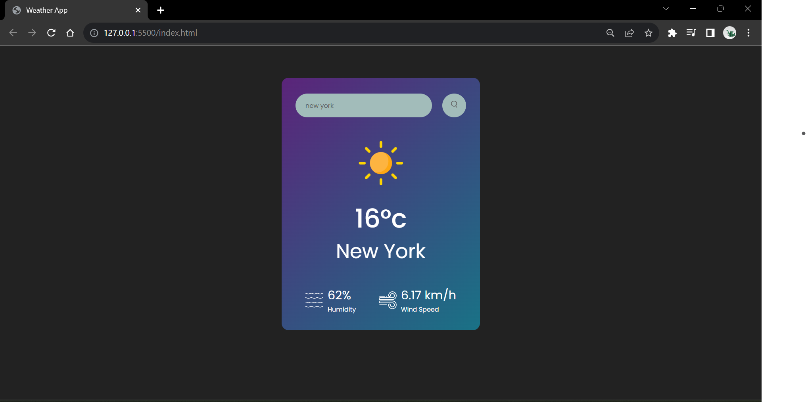

# Weather App README

## Overview

Welcome to the Weather App! This is a simple and user-friendly web application that provides real-time weather information for locations around the world. It's designed to help users quickly access accurate weather data and forecasts.

## Features

- **Real-time Weather Data**: Get up-to-date weather information for any location.
- **Search Locations**: Search for weather information by city name or ZIP code.
- **Detailed Weather Reports**: View detailed weather reports, including temperature, humidity, wind speed, and more.
  

## Live on : 
- https://anuj3412.github.io/Weather-App/

Enjoy using the Weather App! If you encounter any issues or have suggestions for improvements, please feel free to open an issue on GitHub.
